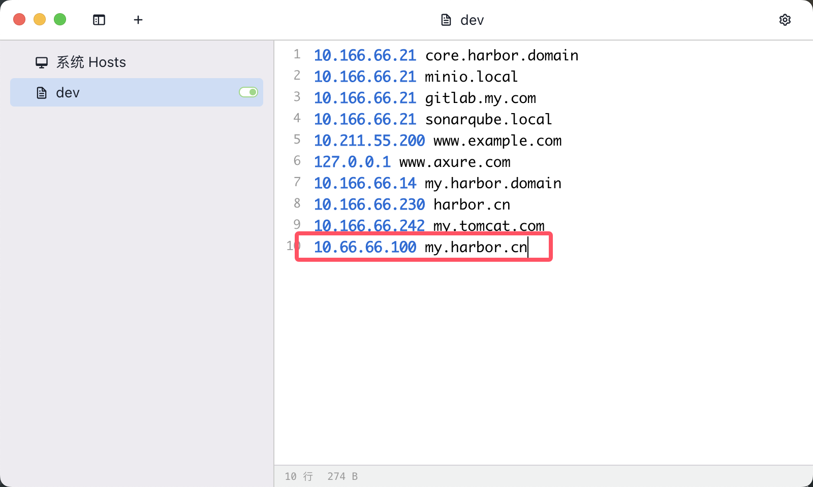
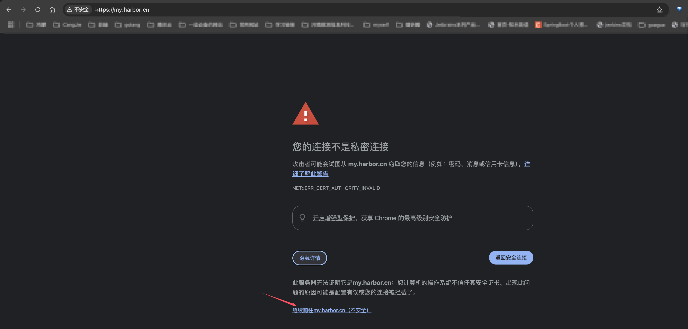
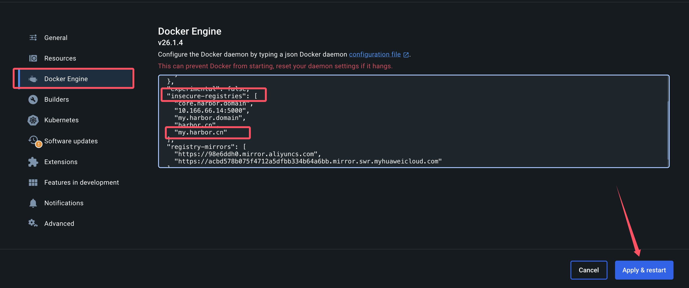

## 准备工作
上传harbor-offline-installer-aarch64-v2.10.2.tgz 到 家目录  
上传 docker-compose 到家目录，需要下载  
上传 crictl 到家目录，需要下载  
上述准备工作可以在执行完1-harbor-pre-install.sh 脚本后通过rz 上传

## 安装 harbor
本文安装 harbor 的服务器 ip 地址为 10.66.66.100  
本文安装后 harbor 的访问域名为 my.harbor.cn  
将 1-harbor-pre-install.sh 和 2-harbor-install.sh 上传到服务器  
赋予权限，执行  
执行 1-harbor-pre-install.sh 服务器会重启，重启完成之后再执行 2-harbor-install.sh
```shell
chmod +x 1-harbor-pre-install.sh
chmod +x 2-harbor-install.sh 
./1-harbor-pre-install.sh
./2-harbor-install.sh
```

## 宿主机配置 hosts 映射
10.66.66.100 my.harbor.cn  


## 访问 harbor web 页面
在浏览器输入 my.harbor.cn，访问harbor web 界面  
因为证书是自签的，不可信，在谷歌浏览器需要设置一下, 点击高级    
  
点击继续前往  
  
用户名/密码：admin/Harbor12345, 点击登录  
  
新建公开的 k8sstudy 项目，后续需要的镜像文件都放入该目录  


## 宿主机配置非安全的镜像仓库地址
非安全的镜像仓库地址，根据实际情况进行替换。
当启用非安全的镜像仓库时，docker运行会执行以下步骤：
* 首先，尝试HTTPS;
* 如果HTTPS可用，但证书无效，则忽略关于证书的错误;
* 如果HTTPS不可用，则回到HTTP。

配置如下，完成后点击Apply and Restart  
    
执行 docker login my.harbor.cn -u admin -p Harbor12345  
结果如下，代表登录成功  

## 构建镜像
可以将本项目docker-images 目录下 kindest 和 nettool 构建成对应镜像