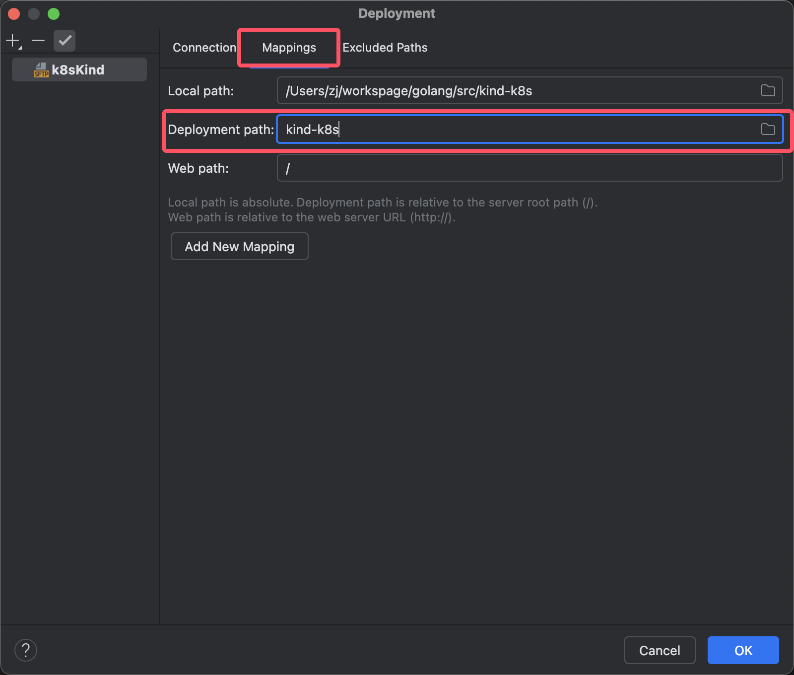

## 准备工作
kind-linux-arm64 上传用户家目录, 需要下载  
kubectl 上传用户家目录, 需要下载  
crictl 上传用户家目录, 需要下载  
本目录下 daemon.json 上传用户家目录  
本目录下 config.toml 上传用户家目录  

上述准备工作可以在执行完1-kind-pre-install.sh 脚本后通过rz 上传  

## 安装
使用vim 创建文件 1-kind-pre-install.sh，向内容复制进去  
赋予执行权限，然后执行  
```shell
chmod +x 1-kind-pre-install.sh
./1-kind-pre-install.sh
```
将2-kind-install.sh 和 update-hosts.sh 上传到服务器  
赋予执行权限，然后执行, 2-kind-install.sh执行过程中会调用 update-hosts.sh 脚本，配置hosts映射  
my.harbor.cn 10.66.66.100 根据实际情况调整   
在 2-kind-install.sh 最后，会拉取两个镜像，测试 docker 和 container 是否可以从 自建 harbor 拉取镜像，需要提前准备对应镜像  
可以将本项目docker-images 目录下 kindest 和 nettool 构建成对应镜像  
```shell
chmod +x 2-kind-install.sh
chmod +x update-hosts.sh
./2-kind-install.sh
```
k8sKind 服务器ip 地址为 10.66.66.140

## Goland 配置 远程文件夹同步
本项目后续需要写很多文件，来使用kind 在服务器部署 k8s 集群，来完成一些实验，因此需要配置和服务器之间的同步  
点击Goland Tools -> Deployment -> Configuration 开始配置同步  
  
点击 + 号，选择SFTP  
  
输入server name，这里输入k8sKind  
  
点击... 来添加 SSH 配置  
  
点击 + 号，开始配置 SSH ，输入 Host、Username、Password、点击 Test Connection 测试连接  
  
配置 root path  
  
配置mappings，root path + Deployment path 是同步至服务器的完整路径  
  
测试同步，后续文件修改也会自动同步到服务器    
  
在服务器查看是否同步    
  